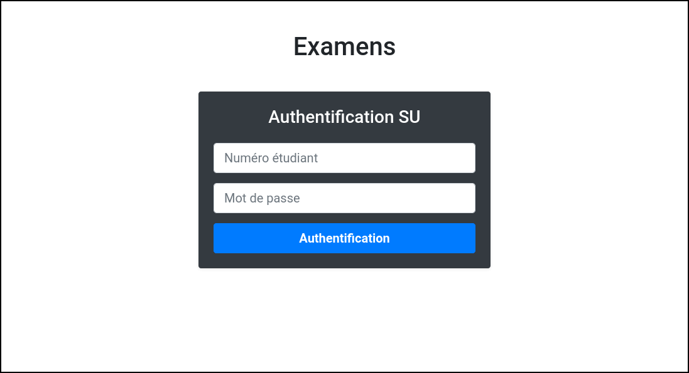
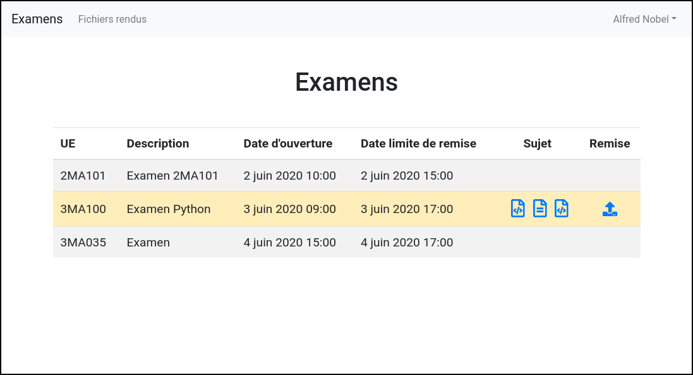
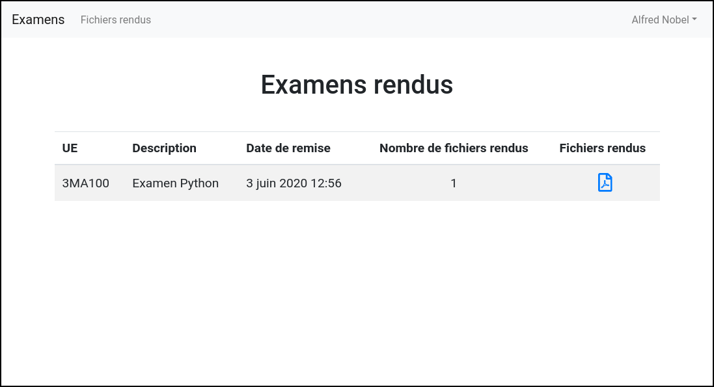
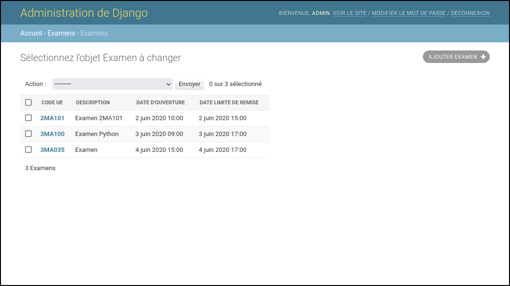
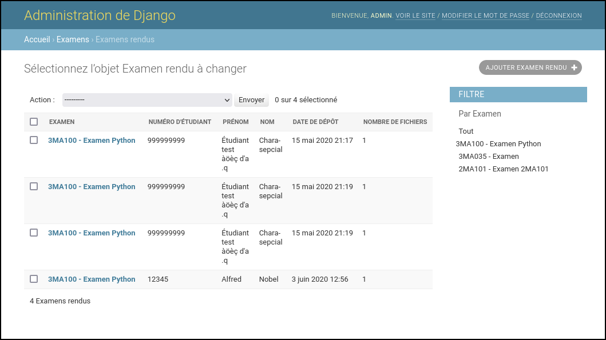

# Basic website for online exams management

Basic Django website to manage online exams at [Sorbonne University](https://www.sorbonne-universite.fr/) during the COVID-19 pandemic.

## Description

Due to the COVID-19 pandemic and full online teaching the Moodle website of [Sorbonne University](https://www.sorbonne-universite.fr/) was highly unstable due to high load. This Django website allow very basic management of online exams in case Moodle is not available for the Mathematics Department.

The whole interface is written in French but it should be easy to adapt it to another language.

Student interface:
* Authentication using university LDAP (with caching in case LDAP is down);
* List of past and upcoming exams;
* Download of assignment files only during allowed time slot;
* Upload of student answers only during allowed time slot;
* View rendered files.

Admin interface:
* Add exams with `pdf`, `html` and/or `ipynb` files with starting and ending time;
* List and download rendered files with filtering capabilities.

## Configuration

This Django website can be run locally and put to production using the standard Django procedure.

On production, be careful that the uploaded files in the `data` directory are not accessible.

## Screenshots

    
    
<em>Authentication using LDAP backend.</em>

    
    
<em>List previous, pending and next exams. Download of the assignment and upload of the answers only allowed during defined time slot.</em>

    
    
<em>Student view of uploaded files.</em>

    
    
<em>Admin interface to manager exams.</em>

    
    
<em>Admin interface to manager rendered files.</em>

## Author

    Julien Guillod
    julien.guillod CHEZ sorbonne-universite.fr
    https://guillod.org/
    Mathematics Department
    Sorbonne University
    France